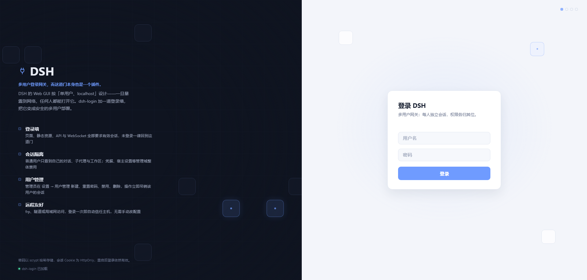
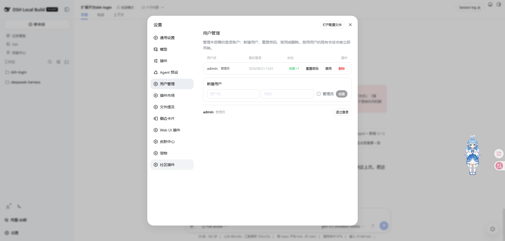

# dsh-login

English | [简体中文](./README.zh.md)

Adds a **login page, user accounts, and per-user conversation isolation** to the [DeepSeek Harness](https://github.com/deepseek-ai/deepseek-harness) Web GUI: every visit requires sign-in, ordinary users cannot see each other's conversations, and an admin manages all accounts from inside the GUI.

| Login page | User management (设置 → 用户管理) |
|:---:|:---:|
|  |  |

## The problem it solves

The DSH Web GUI ships with **no login** — it assumes a single user on localhost. The moment you bind it to `0.0.0.0` (phone access, LAN sharing, a small team), **anyone on that network can open your GUI**: read every conversation, burn your configured model API keys, even change host settings.

`dsh-login` turns that exposure into a multi-user deployment:

- 🔐 **Login wall** — pages, static assets, SPA routes, the API, and WebSockets all require a valid session; unauthenticated visitors are redirected to `/login`
- 👥 **Multiple accounts** — the first visit creates the administrator account; further users are added by an admin right inside the GUI, no CLI needed
- 🙈 **Conversation isolation** — ordinary users see and act on **their own** conversations only (including their subagents/forks); other users' sessions, messages, and workspaces are invisible; credentials, host settings, and other admin domains are forbidden wholesale
- 🛠 **User management** — 设置 → 用户管理: last-login time, online session count, reset password, disable, remove; disabling/removing/password-changes **immediately revoke** that user's live sessions
- 👑 **Admin exception** — the admin is not isolated: all sessions visible, full configuration access
- 🚪 **Logout** — every user gets a logout entry in their settings panel
- 🌐 **Remote access friendly** — reach the GUI through frp/隧道/tunnels or a LAN IP without hand-editing `trustedHosts`: the `/api` host-trust fence uses a live set (LAN literals + `trustedHosts` + auto-learned hosts), and any successful login learns its Host into a persisted whitelist you can manage in 设置 → 用户管理

## Quick start

No environment variables, no config edits — three steps:

```bash
# 1. Install (web is the profile that boots the Web GUI)
dsh plugin --profile web add github:islibaodong/dsh-login
```

2. **Initialize**: restart `dsh web` and open the GUI — the first visit shows a one-time "create administrator account" page; pick a username and password
3. **Add users**: sign in as admin → 设置 → 用户管理 → 新建用户

Uninstall:

```bash
dsh plugin --profile web remove @islibaodong/dsh-login
```

> Why `--profile web`? DSH installs plugins per profile directory (`$DSH_HOME/profiles/<name>`); `web` is the profile that boots the Web GUI. Use your profile's name if you run a custom one.

## FAQ

- **Do I have to log in again after restarting DSH?** No — login sessions are persisted to `<dataDir>/sessions.json` (0o600), so an existing cookie keeps working across a process restart (the cookie otherwise lasts 7 days by default). Only an actual log-out, password change, user removal, or TTL expiry invalidates it.
- **What can an ordinary user do?** Use the chat normally: create/open/continue their own sessions, run subagents, manage their own workspace content. Everything else (other people's sessions, credentials, plugins/presets/host settings, model-key management) is refused.
- **Upgrading from the old single-password version?** The old single password no longer logs anyone in; the first visit after upgrading bootstraps a fresh administrator account (details in the migration note below).

---

# Technical details

> For contributors, security reviewers, and troubleshooting. You don't need any of this to use the plugin.

## What installation does

`dsh plugin add` reads this package's declared `cordis.patch.yml` (a bundle patch) and automatically:

- mounts the `dsh-login` plugin row (config defaults are sensible; `distIndex` resolves the frontend dist automatically)
- disables the `web-runtime` row (where dsh-web-app mounts the frontend-static fallback); dsh-login takes over the fallback seat and re-provides the `webRuntime` service (LAN trust for the `/api` fence + the `DSH_WEB_URL` variable)
- disables the shipped `connection` row (the `/api` carrier); dsh-login mounts its own identity-aware takeover and ships the matching browser bundle `dist/client.js`

### Manual installation (alternative)

If you prefer managing the patch file yourself, add these rows to your profile's `cordis.patch.yml`:

```yaml
- insert:
    - id: dsh-login
      name: '@islibaodong/dsh-login'
      config:
        password: DSH_LOGIN_PASSWORD   # credential ref name; namespaces the user store (<name>_USERS)
        distIndex: ''                  # empty resolves the frontend dist automatically
        dataDir: ''                    # empty resolves to <DSH_HOME>/.dsh-login (ownership index)
        sessionTtl: 604800             # 7 days (default)
        autoTrustHosts: true          # learn the Host of any successful login into the /api whitelist
        enabled: true                 # set false to disable without uninstalling
        defaultWorkspace: true        # auto-provision a per-user default workspace on first /api access (on by default; toggleable live in 设置-用户管理)
        workspaceRoot: ''             # default-workspace sandbox root; empty => <DSH_HOME>/workspaces

# IMPORTANT: dsh-login takes over the fallback seat, so the web-runtime row
# (which mounts frontend-static) must be disabled. dsh-login re-provides the
# webRuntime service, so the rest of the composition is unaffected.
- id: web-runtime
  disabled: true

# IMPORTANT: the WebServer rejects duplicate /api prefix registrations, so the
# shipped connection row must stay disabled; dsh-login mounts its own
# identity-aware takeover (and ships the browser bundle dist/client.js).
- id: connection
  disabled: true
```

> Note: new rows must live under `- insert:` — a bare top-level row is treated as an override of an existing row and is a silent no-op for new ids; and the disable key is `disabled` (not `disable`).

## First-time setup flow

1. **First visit** (no users yet) -> `/login` shows a "Create administrator account" page (username + password)
2. User picks credentials -> `POST /api/auth/setup` creates the forced-admin account (scrypt-hashed, stored under the `${password}_USERS` credential ref, default `DSH_LOGIN_PASSWORD_USERS`) and logs it in
3. **Subsequent visits** -> `/login` shows the normal username/password login form
4. **User management** -> admins open 设置 → 用户管理 in the GUI to list (last login/online status), create, disable/enable, remove users and reset passwords (`/api/auth/admin/*` JSON routes; removing the last admin is refused)
5. **Security** -> `/api/auth/setup` returns 403 once any user exists, preventing hijacking

> **Migration note:** the legacy single-password credential (default ref `DSH_LOGIN_PASSWORD`) no longer logs anyone in. It stays configured but is unused for authentication — the `password` config key now only namespaces the user store credential ref (`${password}_USERS`). Upgrading an existing single-password deployment therefore requires the first visit to bootstrap a fresh administrator account.

## How it works

```
Request -> WebServer
  ├─ /login (exact)            -> setup page (if no users) OR login page
  ├─ /api/auth/setup (exact)  -> POST: create admin on first use (403 if users exist)
  ├─ /api/auth/login (exact)  -> POST: verify {username,password}, set cookie
  ├─ /api/auth/logout (exact) -> POST: revoke session, clear cookie
  ├─ /logout (exact)          -> GET: same revocation, redirect to /login
  ├─ /api/auth/me (exact)     -> GET: current session identity
  ├─ /api/auth/admin/* (exact) -> admin JSON API (users, password, disable, remove)
  ├─ /api/* (prefix)          -> dsh-login connection takeover:
  │                             ├─ untrusted host -> 403
  │                             ├─ no valid cookie -> 401
  │                             ├─ GET on event paths -> 426 (upgrade required)
  │                             └─ per-user dispatch through a filtered proxy
  ├─ /api/events.mux + /api/events.host (WS upgrade) -> same trust + cookie checks,
  │                             then ownership-filtered per-user downlinks
  └─ fallback                  -> dsh-login: auth gateway + static files
                                  ├─ no valid cookie -> 302 /login
                                  └─ valid cookie   -> serveStatic()
```

- **Cookie:** `dsh_session`, HttpOnly, SameSite=Strict, Path=/
- **Session:** 32-byte random token (256-bit) with TTL expiry; sessions carry the username and admin flag and are persisted across restarts (<dataDir>/sessions.json, 0o600), so an in-flight SPA keeps working after a process reload instead of turning every /api call into a 401
- **Password storage:** scrypt hashes (per-user salt) in the DSH credentials system under `${password}_USERS`

## Multi-user permission model

- **Ordinary users are conversation-only.** Through the `/api` takeover they see and act on their **own** sessions plus lineage children (subagents/forks — ownership follows `parentSessionId`), and workspace views are filtered down to owned sessions. Everything else is off limits:
  - physical allow-list: a fixed set of `session.*`, `subagent.*`, `workspace.*`, `goal.*` methods plus `skill.list`, `host.describe`, `llm.providers`/`llm.models` and `respond`; any other wire method is a 403 before it reaches the harness
  - admin-only domains: `credentials.*`, `settings.*`, `agentPresets.*` are forbidden wholesale
  - also forbidden: `llm.discoverModels` and the privileged `host.*` directory dialogs (`pickDirectory`, `listDirectory`, `createDirectory`, `openPath`)
  - workspace-scoped mutations are ownership-guarded by `workspaceId`: a non-admin may only `rename`/`delete`/`insertBefore` a workspace that holds at least one of their own sessions, and `create` is confined to their own sandbox (`workspaceRoot/<username>`) — so they cannot touch other users' workspaces or register a workspace pointing at an arbitrary host directory
  - the physical `session.export` channel (target in the query string, outside the envelope) is ownership-guarded at the carrier
  - event streams (mux/host WebSocket frames) are filtered by ownership, so other users' traffic never reaches the browser
- **Default user workspace (`defaultWorkspace`, on by default):** non-admin users get a per-user isolated default workspace on first `/api` access — `mkdir` their sandbox (`workspaceRoot/<username>`, default `<DSH_HOME>/workspaces/<username>`) → register it in the durable workspace registry → attach one session (`sessions.create({ workspaceId })`, the grouping shape) and record its ownership, so the workspace is immediately visible in the user's `workspace.list` and ready to use. This solves ordinary users being unable to add a workspace on public/FRP deployments (the frontend flow needs the privileged, non-admin-forbidden `host.pickDirectory`) **without loosening that security boundary**. Admins can toggle it live from the 设置 → 用户管理 panel's 默认用户工作空间 switch (persisted to `<dataDir>/settings.json`, effective immediately, no restart); turning it off does not remove existing workspaces. Provisioning is idempotent (once per user per process) and best-effort (failures never fail the triggering request).
- **Remote access compat (`remoteWebUiCompat`, on by default):** accommodates `@linxin666/dsh-remote-web-ui` unchanged. That popular plugin's `/remote` device-pairing gate 401s non-loopback (public FRP) desktop traffic — the model dialog, history, composer — independently of dsh-login's /api auth. When this flag is on, dsh-login writes remote-web-ui's `enabled:true` (which is what actually mounts its host routes; without it the server answers nothing and the client fail-closes onto a dead `/remote` 405 wall) and `requirePairingForLan:false` (a **live, settings-backed** flag re-read per request), so non-loopback traffic rides dsh-login's `/api` channel gated by the `dsh_session` cookie instead. It also writes `publicBaseUrl` from the `remoteWebUiPublicBaseUrl` config when that is set — required for a public FRP/tunnel host so remote-web-ui's Host-header-based `/api/pair/*` fence trusts the ordinary-user origin (otherwise the browser there gets 403 on `/api/pair/status` and the client still fail-closes onto `/remote`). No-op when remote-web-ui is not installed; admins toggle it live from the 设置 → 用户管理 panel's 远程访问兼容 switch (persisted, effective immediately). Note: with `remoteWebUiCompat` defaulting to on, the pairing barrier is off for every dsh-login + remote-web-ui deployment — intended, since dsh-login's own /api auth still sits in front.
- **Capability discovery + quiet denials (`quietDenials`, on by default):** stops the browser-splashing "forbidden" walls that installed UI plugins (task-board, plugin-manager, agentPreset, doctor, …) trigger on an ordinary-user session when they probe `/api/*` they cannot use. Three layers: (1) `GET /api/auth/capabilities` returns the authenticated identity's method/domain/UI-plugin surface (ordinary = the `USER_ALLOWED` allow-list + core plugins; admin = everything), and dsh-login injects a static non-admin baseline into `window.__DSH_SESSION__` at index-render time so clients that read it render no unauthorized feature instead of probing; (2) the physical `/api` layer answers a side-effect-free read probe (`credentials.list`, a GET on a forbidden path, a QUIET_DENY_METHODS verb) with **204 No Content** instead of 403, so the browser does not error/retry; (3) side-effecting writes keep **403** unchanged. Authorization is never loosened — only the shape of a denied read is quieter. Admins can flip `quietDenials` off to restore plain 403 everywhere.
- **Admin sees and does everything:** unfiltered API access, all sessions/workspaces visible, and the 设置 → 用户管理 settings section.
- **Logout:** the settings panel's 用户管理/账户 section carries a logout entry for every user (POST `/api/auth/logout` → `/login`); `GET /logout` works as a plain link.
- **Admin user management (设置 → 用户管理):** ships inside the GUI settings panel via the browser bundle — no separate page. Inside it, the **Allowed Hosts / Trusted Hosts** card lists the `/api` whitelist (learned + manually added) with add/remove — removing takes effect immediately. A **默认用户工作空间** switch toggles the per-user default-workspace provisioning live (persisted, no restart), and a **远程访问兼容** switch toggles the remote-web-ui `requirePairingForLan` bypass. The user list reports each account's last-login time (stamped on every successful login; `never` before its first login after the feature shipped), online session count, and disabled flag; per-row actions reset passwords, disable/enable, and remove users (single non-wrapping line, right-aligned). Ordinary users get an 账户 section (identity + logout). The panel styles itself entirely through the framework's `--dsw-alias-*` theme tokens, so it follows the app skin (light/dark) automatically.

## Data locations

| Data | Location |
|------|----------|
| User accounts (scrypt hashes) | DSH credentials system, ref `${password}_USERS` (default `DSH_LOGIN_PASSWORD_USERS`) |
| Session→user ownership sidecar | `<DSH_HOME>/.dsh-login/ownership.json` (configurable via `dataDir`; `DSH_HOME` env or `~/.dsh`) |
| Auto-learned / admin Host whitelist | `<DSH_HOME>/.dsh-login/trusted-hosts.json` (configurable via `dataDir`) |
| Default-user-workspace toggle | `<DSH_HOME>/.dsh-login/settings.json` (configurable via `dataDir`) |
| Remote-web-ui compat toggle | `<DSH_HOME>/.dsh-login/settings-remote-web-ui.json` (configurable via `dataDir`) |
| Login sessions | `<DSH_HOME>/.dsh-login/sessions.json` (0o600; persisted across restarts, TTL drops stale) |

## `/api` carrier takeover & the client bundle

This plugin replaces the shipped `/api` connection row: `cordis.patch.yml` disables it (the WebServer rejects duplicate `/api` prefix registrations, so the shipped row must stay off) and `dsh-login` mounts its own identity-aware carrier (`src/connection.ts`) as a child plugin — same host-trust fence, but every request is resolved from the session cookie and dispatched per user.

**Host trust is evaluated live per request.** Instead of a static list, the fence checks a deduped effective set — LAN literals from the web runtime + `trustedHosts` + the persisted whitelist (`src/hosts.ts`). A successful login/setup auto-learns the request Host (gated by `autoTrustHosts`, default true), so a public host reached through frp/隧道/tunnels is trusted after one login; learned hosts bind immediately and removals apply without a restart.

The browser half is untouched protocol-wise, but the GUI's wire client must keep coming from this package: the client-modules scanner drops browser halves of disabled rows from the boot graph. dsh-login therefore declares its own `dsh.client` and ships the bundle `dist/client.js` — a re-stamped copy of the shipped connection client (`src/connection.client.ts` re-exports it verbatim) **plus a second module registration**: the settings-panel wrapper (`src/settings-panel.client.js`) that applies the wire client verbatim and registers the 设置 → 用户管理/账户 settings section (styled via the framework's `--dsw-alias-*` theme tokens; stylesheet pre-tagged `data-plugin`/`data-plugin-css` the way the framework's own bundle preset does). The `dsh.client.inject` field follows the ecosystem convention — it lists the PACKAGE ids behind the services the browser half needs (`@deepseek-ai/dsh-client-ui-settings`, `@deepseek-ai/dsh-client-locale`), not service names; the runtime fiber's exported `inject` stays authoritative. React and the UI primitives resolve through the platform module-table seeds every bundle may require. Regenerate it with:

```bash
npm run build:client   # node scripts/build-client.mjs; uses node_modules or $DSH_HARNESS_CHECKOUT
```

**You must re-run this after upgrading `@deepseek-ai/dsh-client-connection` or editing `src/settings-panel.client.js`**, or the browser bundle goes stale against the new carrier.

## Security notes

### Protected by the gateway

| Asset | Protection |
|-------|-----------|
| Page navigation (`/`) | 302 redirect to `/login` if unauthenticated |
| Static assets (`/assets/*.js`, `.css`, etc.) | Same gateway check |
| SPA routes (`/conversations`, `/settings`, etc.) | Same gateway check |

### Protected by the carrier takeover

| Asset | Protection |
|-------|-----------|
| API requests (`/api/*`) | `isTrustedApiRequest` host trust **and** a valid `dsh_session` cookie (401 without one); non-allowed methods 403 for ordinary users |
| WebSocket (`/api/events.mux`, `/api/events.host`) | Same host-trust + cookie checks on upgrade; frames ownership-filtered per user |

### Recommendations for public exposure

1. With `autoTrustHosts` on (default), any successful login learns its Host into the whitelist (`/api/auth/admin/hosts`, manageable in 设置 → 用户管理), so an frp/tunnel host is trusted after one login — no `trustedHosts` editing needed. Keep it on unless you want only loopback + an explicit `trustedHosts` set to be accepted.
2. Use a reverse proxy (nginx/caddy) with TLS termination in front of DSH.
3. The gateway cookie is `SameSite=Strict`, protecting against CSRF on the login/logout endpoints.

**Troubleshooting: a non-admin user "cannot add a workspace" over a public tunnel?**

Diagnosis quick reference: this is almost never the host whitelist (autoTrustHosts already learns the public host and login succeeds). The real blocker is that ordinary users are denied the **privileged directory picker** `host.pickDirectory` by design (`api-filter.ts` deliberately 403s it for non-admin users, together with `listDirectory`/`createDirectory`/`openPath`). The frontend's add-workspace flow must call `pickDirectory` to choose a host directory, so non-admins get stuck — e.g. `transport failure for /api/host.pickDirectory: HTTP 403`.

- This is isolation-by-design, not a broken deployment. **Do not** "fix" it by allowing `host.pickDirectory` for ordinary users (that would let them browse/choose arbitrary host directories and break multi-user isolation).
- The correct fix is this plugin's **default user workspace** (`defaultWorkspace`, on by default): a non-admin's first `/api` access auto-provisions a per-username-isolated sandbox workspace (with a starter session, immediately visible in `workspace.list` and usable), entirely bypassing the blocked picker. Admins toggle it live from the 设置 → 用户管理 panel's 默认用户工作空间 switch.
- If autoTrustHosts is on, public login works, yet /api still 403s, it is almost certainly this pickDirectory method-level permission rather than the trust fence.

## Architecture note: fallback vs prefix /

The gateway uses `registerFallback()` (not `register({ kind: 'prefix', path: '/' })`) because the DSH WebServer's prefix matching checks `pathname.startsWith(prefix + '/')`. For prefix `/`, this becomes `//`, which no normal path starts with -- a `prefix /` route only matches the exact path `/`. The fallback handler catches everything no named route claims, which is the correct catch-all behavior for the authentication gateway.

The WebServer has a single fallback seat. dsh-web-app's `web-runtime` row mounts frontend-static over it unconditionally, so the `web-runtime` row must be disabled when using `dsh-login`; dsh-login re-provides the `webRuntime` service that row owned (LAN trust, `DSH_WEB_URL`), leaving the rest of the composition intact.

## Running tests

```bash
# Canonical full suite (185 tests; requires the DSH checkout for package
# resolution — set DSH_HARNESS_CHECKOUT or run beside the default path)
npx vitest run
```

The `.spec.ts` files are the canonical vitest definitions, including the multi-user suites (`users`, `ownership`, `hosts`, `api-filter`, `connection`, `admin-api`, `multiuser-e2e`, `client-bundle`, `settings-panel`, `remote-web-ui-compat`). `tests/runner.mjs` and `tests/integration-runner.mjs` are sandbox-compatible harnesses for the original single-password core only; they were not extended for the multi-user feature.

## Project structure

```
src/
├── index.ts          # Cordis plugin entry: registers routes, fallback, ownership + connection child plugin
├── config.ts         # schemastery config schema (password, distIndex, dataDir, sessionTtl, ...)
├── users.ts          # UserStore: user records, scrypt hashing, credentials-backed persistence
├── session.ts        # SessionStore: sessions (user + admin flag) with TTL expiry, persisted across restarts
├── ownership.ts      # OwnershipIndex: sessionId → username sidecar (debounced JSON file)
├── hosts.ts          # TrustedHosts: /api host-trust whitelist (live set + debounced JSON persistence)
├── api-filter.ts     # per-user ApiProxy decorator: allow-list, ownership guards, frame filtering
├── connection.ts     # dsh-login-connection: /api carrier takeover + WS downlinks (child plugin)
├── connection.client.ts  # browser half: re-exports the shipped connection client verbatim
├── settings-panel.client.js  # settings-panel browser half (plain JS): 用户管理/账户 section, theme-token styled
├── workspace-setting.ts  # 默认用户工作空间 runtime toggle (extends BooleanSetting)
├── boolean-setting.ts  # live + persisted {enabled} runtime flag shared by admin switches
├── remote-web-ui-compat.ts  # writes remote-web-ui's enabled+requirePairingForLan+publicBaseUrl (settings-backed, live) to mount its routes & bypass pairing / trust the public host
├── capabilities.ts  # capability discovery (deriveCapabilities) + read-probe classifier (isReadProbe/QUIET_DENY_METHODS)
├── admin-api.ts      # /api/auth/me + /api/auth/capabilities + /api/auth/admin/* JSON routes (settings-panel backend)
├── auth.ts           # Cookie management + constant-time compare helpers
├── gateway.ts        # Auth gateway handler (fallback + serveStatic)
├── login-api.ts      # POST /api/auth/login + logout + setup
├── login-page.ts     # Login and setup page HTML
├── http-json.ts      # readBody/sendJson helpers + resolveDshHome
└── web-runtime.ts    # webRuntime takeover: LAN trust + DSH_WEB_URL
dist/client.js        # built browser bundle (npm run build:client)
scripts/build-client.mjs  # regenerates dist/client.js: shipped carrier bundle + settings panel
tests/
├── *.spec.ts         # vitest test definitions
└── memory-credentials.ts   # Test-only in-memory credential provider
```

## License

MIT
