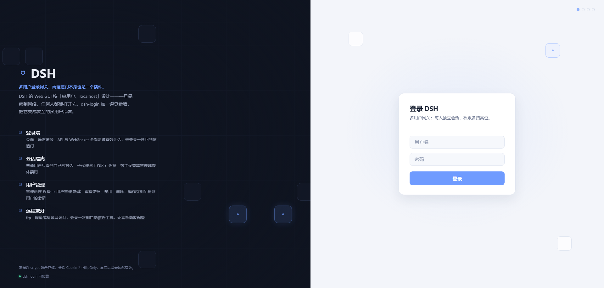
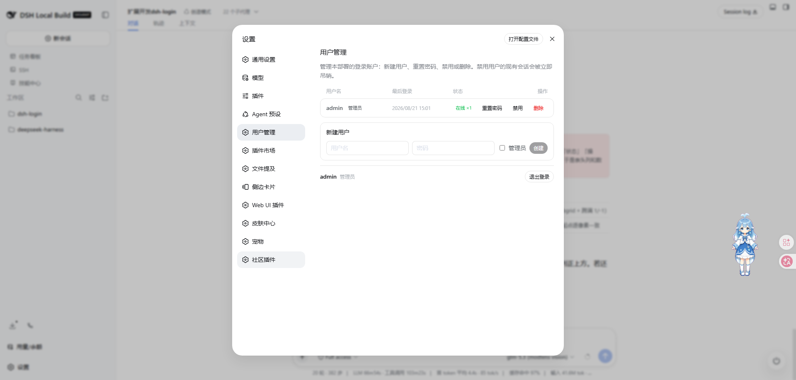

# dsh-login

English | [简体中文](./README.zh.md)

Adds a **login page, user accounts, and per-user conversation isolation** to the [DeepSeek Harness](https://github.com/deepseek-ai/deepseek-harness) Web GUI: every visit requires sign-in, ordinary users cannot see each other's conversations, and an admin manages all accounts from inside the GUI.

| Login page | User management (设置 → 用户管理) |
|:---:|:---:|
|  |  |

> **Released: `@islibaodong/dsh-login@0.3.2` (git tag `v0.3.2`; published on npm — `latest` = 0.3.2).** Verified against DSH **0.2.1-alpha.2** (2026-10-10; full suite 19 files / 247 tests green on the published alpha builds). Option A: upstream reworked the `/api` transport — dsh-login no longer takes it over (the `connection` row is re-enabled) and answers 401 on the shared `/api` bridge without a session (`apiBridgeAuth`, default on). **New in 0.3.2: tracking DSH 0.2.1-alpha.2** — upstream added TLS (HTTPS) to the webserver, moved the connection trust authorities to the new `webStartup` service, and **retired the `webRuntime` service upstream** (dsh-login's `takeOverWebRuntime` re-provide is now compat-only) — the `dsh web:` URL line and `DSH_WEB_URL` now spell the actual bind address, matching upstream. 0.3.1: the bridge wall enforces the `USER_ALLOWED` method allow-list for ordinary users, narrows their `session.list`/`session.search`/`workspace.list` responses to owned sessions, keeps the ownership sidecar warm (session/workspace/`fork` recording + per-user default-workspace provisioning), and ships a deployment glue (`composeDshLoginGuard` + [`docs/compose-guard.md`](docs/compose-guard.md)) for composing the REMOTE-layer isolation guard over the native `typertGateway` — the two-browser sign-off of that composition remains a deployment-side acceptance step. 0.3.0 added per-role whole-UI gating (`uiRoleGate`, default on) — ordinary users never mount the admin-only client bundles (the boot-graph lever documented below). See [`Current status →`](#current-status--released) and [`docs/verify-option-A.md`](docs/verify-option-A.md).
>
> **Adaptation history (all versions below are published on npm):** `0.2.1` → DSH 0.1.6-alpha.1 (sidebar **terminal**, **unarchive sessions**); `0.2.2` → 0.1.6-alpha.2 (the `apiBridgeAuth` wall on the shared `/api` bridge, the document-preview `workspaceFiles`/`officeToPdf` user surface, the native `pluginManager` namespace admin-only); `0.2.3` → 0.1.7-alpha.2 (settings seam re-home, the new `account` namespace admin-only, the `job` controller user surface, session pinning); `0.2.4` → the DSH #4587 settings-error fix; `0.2.5` → DSH 0.2.0-rc.2 (peer retarget onto the 0.2.0 tuple line — the surface verified source-compatible, no code change); `0.2.6` → the issue #3 fix (a fresh device's first page load after login hit the core BrowserAuth's plain-text 401 — the gateway now bounces once through the `?token=` exchange so the core mints its browser cookie); `0.2.7` → DSH 0.2.1-alpha.1 (peer retarget onto the 0.2.1 tuple line + the retired `@deepseek-ai/dsh-invariants` references removed — no source change); `0.3.0` → the per-role whole-UI gate (`uiRoleGate`) implemented on the boot-graph lever (still tracking DSH 0.2.1-alpha.1); `0.3.1` → the shared-`/api` bridge wall gains per-user enforcement (the `USER_ALLOWED` method gate, owned-only `session.list`/`session.search`/`workspace.list` narrowing, ownership recording including admin record-only, default-workspace provisioning wiring) plus the `composeDshLoginGuard` deployment glue (no upstream change — still 0.2.1-alpha.1); `0.3.2` → DSH 0.2.1-alpha.2 (devDep retarget — the peer tuple already admitted alpha.2 — plus the `dsh web:` URL line/`DSH_WEB_URL` now spelling the actual bind address; upstream retired its `webRuntime` service, so dsh-login's takeover is compat-only, and upstream added TLS). 0.1.7-rc.1 / rc.2 were verified compatible without a release — details in [`docs/adapt-dsh-0.1.7-rc.1.md`](docs/adapt-dsh-0.1.7-rc.1.md) / [`docs/adapt-dsh-0.1.7-rc.2.md`](docs/adapt-dsh-0.1.7-rc.2.md) / [`docs/adapt-dsh-0.2.0-rc.2.md`](docs/adapt-dsh-0.2.0-rc.2.md). Upstream still has **no** native multi-user support and **no** per-role UI gating (re-verified at 0.2.1-alpha.2).

---

## Current status — released (option A)

**`@islibaodong/dsh-login@0.3.2` is released (git tag `v0.3.2`; published on npm — `latest` = 0.3.2).** The option-A adaptation for DSH ≥ 0.1.5-alpha.1 is complete and tracks upstream through **0.2.1-alpha.2** (verified 2026-10-10): dsh-login no longer takes over `/api` — the native `connection` + `api-remotes`/`api-gateway` stack owns the transport — and composes the login wall (fallback seat), the `apiBridgeAuth` wall on the shared `/api` bridge, and capability discovery on top of it. **0.3.0 ships the per-role whole-UI gate**: with `uiRoleGate: true` (default) the gateway filters the `window.__DSH_BOOT__` graph for ordinary users so admin-only client bundles never mount (`src/ui-gate.ts`; deny-list = `ADMIN_ONLY_UI_PLUGINS`; admins and `uiRoleGate:false` see the full graph; fail-open on any unexpected shape). The bridge wall adds (0.3.1) the per-user method gate (`USER_ALLOWED`), owned-only response narrowing for `session.list`/`session.search`/`workspace.list`, ownership recording (including admin-created resources, record-only), and per-user default-workspace provisioning. 0.3.2 retargets the devDeps to 0.2.1-alpha.2 (peers already admitted it; upstream's `webRuntime` retirement makes dsh-login's takeover compat-only) and mirrors upstream's bind-address URL line. The full suite is **19 files / 247 tests green** against the published 0.2.1-alpha.2 builds; the settings-panel client re-home, the `dist` host rebuild, and the test-suite rewrite are **done**. **Deliberately NOT yet boot-verified (needs a real `dsh web` boot to confirm):** the per-user isolation guard composed over the native `typertGateway` via the shipped deployment glue ([`docs/compose-guard.md`](docs/compose-guard.md)) and the two-browser isolation sign-off (see [`docs/verify-option-A.md`](docs/verify-option-A.md) §B). See [`docs/adapt-dsh-0.1.5.md`](docs/adapt-dsh-0.1.5.md) for the original status matrix.

**Delivered and working**
- Login wall + multi-account user management (设置 → 用户管理).
- Capability discovery (`GET /api/auth/capabilities`, session-authenticated) and quiet read-denials (`204` for a no-permission read probe, `403` for writes; toggle via `quietDenials`), so ordinary-user browsers stop getting "forbidden" walls and retry storms.
- dsh-login's **own** settings contribution is **already per-user**: admins see 设置 → 用户管理, ordinary users see 账户 (identity + logout); ordinary users never call the admin API.
- **Per-user isolation guard ships as a composition primitive (option A).** Under DSH ≥ 0.1.5 the native `connection`/`api-gateway` owns `/api`, so dsh-login's isolation is a REMOTE-layer guard — `wrapRemoteGateway` + `createRemoteIsolation`, exported from this package's host bundle and unit/integration-tested (including ownership scoping and admin passthrough). The wrapper forwards every non-dispatch gateway member unchanged (e.g. DSH 0.2.0-rc.2's required `hasLiveClient()`), so composing it stays interface-complete. `connection` ownership + per-user default workspace are re-established on the native stack. **The guard must be composed over the native `typertGateway` row at boot** (a deployment decision, not a runtime hot-swap — re-providing `typertGateway` would be a duplicate-service error); dsh-login ships ready-made glue for that composition — the ownership sidecar is published as the `dshLoginOwnership` service and `composeDshLoginGuard(ctx, gateway)` wraps a native gateway in one call (see [`docs/compose-guard.md`](docs/compose-guard.md) for a complete row module and acceptance checklist). The two-browser behavior sign-off remains a deployment-side step. See [`docs/verify-option-A.md`](docs/verify-option-A.md) §B.
- **Tracks upstream 0.1.5-alpha.1 → 0.2.1-alpha.2.** Each upstream release's user-facing wire surface joins the ordinary allow-list as it lands (sidebar `terminal.*`, `workspace.unarchiveSession`/`pinSession`/`unpinSession`, the read-only `workspaceFiles`/`officeToPdf` document preview, the `job` controller; 0.2.0 added no new wire methods or namespaces; 0.2.1 added the `claudeCodeMods` namespace — agent-mod band UI above the prompt — which rides the default deny, no user surface yet; 0.2.1-alpha.2 added none either), while new admin-only namespaces (`pluginManager` + `pluginRegistryProbe`, and the `account` DeepSeek-Platform controller — the one process-wide upstream grant, including 0.1.7-rc.2's `watchExpiry` expiry stream) are denied wholesale. Since DSH 0.1.7-rc.1 the host runs a **boot-time plugin-compatibility admission** against peer ranges — dsh-login's ranges admit the current runtime (0.2.7 added the 0.2.1 branch), and the check is fail-open (stderr report only), so after any DSH upgrade verify the login page actually appears. 0.3.0 additionally ships `uiRoleGate` — the per-role whole-UI boot-graph filter (see below).

**Per-role control of the whole UI — SHIPPED in 0.3.0 (`uiRoleGate`)**
- **dsh-login 0.3.0 implements the whole-UI gate in-plugin (no upstream change needed).** The gateway renders the index itself, and the client module roster travels in that HTML as `window.__DSH_BOOT__`; the page then activates exactly that roster (`ClientEntries.reconcile()` creates one entry per manifest row and **removes** any bundle absent from it). For an ordinary (non-admin) session with `uiRoleGate: true` (the default), the gateway rewrites the boot graph before serving the index: entries in the `ADMIN_ONLY_UI_PLUGINS` deny-list are dropped, their batches patched or removed, and the shell never mounts them. Presentation-only — the `/api` allow-list (`apiBridgeAuth` + `USER_ALLOWED`) remains the security boundary. Admins get the unfiltered graph; any unexpected shape fails open (original HTML served). See [`docs/adapt-dsh-0.2.1-alpha.1.md`](docs/adapt-dsh-0.2.1-alpha.1.md) §6.
- **What the gate does NOT do:** per-package granularity only — hiding one slot/section *inside* an allowed bundle (e.g. DSH's settings panel, whose `SettingsRoot` → `useSections` list carries no identity dimension) stays out of scope. DSH's WebServer route priority is **exact-beats-prefix** with no pre-routing hook, so a plugin that self-registers exact routes (e.g. `@linxin666/dsh-pet` serving `/api/pet/pets`) cannot be intercepted per user by `dsh-login` either.
- Upstream still ships **no per-identity gate**: the client boot/activation layer and ui-slots carry no `role`/`permission`/`isAdmin` concept (re-verified 2026-10-10 at 0.2.1-alpha.2; `isAdmin`/`isAllowed` greps return zero hits under `packages/client` — and note that ~238 files still match a raw `role` grep because of DOM `role="…"` accessibility attributes, not account roles).

**Still wanted from upstream:** per-identity slot/section **filtering** (for sub-package granularity *inside* an allowed bundle) and a host-side per-user plugin activation gate. Neither exists at 0.2.1-alpha.2; the 0.3.0 boot-graph gate covers whole packages only.

## The problem it solves

The DSH Web GUI ships with **no login** — it assumes a single user on localhost. The moment you bind it to `0.0.0.0` (phone access, LAN sharing, a small team), **anyone on that network can open your GUI**: read every conversation, burn your configured model API keys, even change host settings.

`dsh-login` turns that exposure into a multi-user deployment:

- 🔐 **Login wall** — pages, static assets, SPA routes, the API, and WebSockets all require a valid session; unauthenticated visitors are redirected to `/login`
- 👥 **Multiple accounts** — the first visit creates the administrator account; further users are added by an admin right inside the GUI, no CLI needed
- 🙈 **Conversation isolation** — ordinary users see and act on **their own** conversations only (including their subagents/forks); the bridge wall denies non-whitelisted methods and narrows `session.list`/`session.search`/`workspace.list` responses to owned sessions, and the composed REMOTE-layer guard scopes dispatches by ownership; other users' sessions, messages, and workspaces are invisible; credentials, host settings, and other admin domains are forbidden wholesale
- 🛠 **User management** — 设置 → 用户管理: last-login time, online session count, reset password, disable, remove; disabling/removing/password-changes **immediately revoke** that user's live sessions
- 👑 **Admin exception** — the admin is not isolated: all sessions visible, full configuration access
- 🚪 **Logout** — every user gets a logout entry in their settings panel
- 🌐 **Remote access friendly** — reach the GUI through frp/隧道/tunnels or a LAN IP without hand-editing `trustedHosts`: the `/api` host-trust fence uses a live set (LAN literals + `trustedHosts` + auto-learned hosts), and any successful login learns its Host into a persisted whitelist you can manage in 设置 → 用户管理

## Quick start

No environment variables, no config edits — three steps:

```bash
# 1. Install (web is the profile that boots the Web GUI)
dsh plugin --profile web add github:islibaodong/dsh-login
```

2. **Initialize**: restart `dsh web` and open the GUI — the first visit shows a one-time "create administrator account" page; pick a username and password
3. **Add users**: sign in as admin → 设置 → 用户管理 → 新建用户

Uninstall:

```bash
dsh plugin --profile web remove @islibaodong/dsh-login
```

> Why `--profile web`? DSH installs plugins per profile directory (`$DSH_HOME/profiles/<name>`); `web` is the profile that boots the Web GUI. Use your profile's name if you run a custom one.

## FAQ

- **Do I have to log in again after restarting DSH?** No — login sessions are persisted to `<dataDir>/sessions.json` (0o600), so an existing cookie keeps working across a process restart (the cookie otherwise lasts 7 days by default). Only an actual log-out, password change, user removal, or TTL expiry invalidates it.
- **What can an ordinary user do?** Use the chat normally: create/open/continue their own sessions, run subagents, manage their own workspace content. Everything else (other people's sessions, credentials, plugins/presets/host settings, model-key management) is refused.
- **Upgrading from the old single-password version?** The old single password no longer logs anyone in; the first visit after upgrading bootstraps a fresh administrator account (details in the migration note below).

---

# Technical details

> For contributors, security reviewers, and troubleshooting. You don't need any of this to use the plugin.

## What installation does

`dsh plugin add` reads this package's declared `cordis.patch.yml` (a bundle patch) and automatically:

- mounts the `dsh-login` plugin row (config defaults are sensible; `distIndex` resolves the frontend dist automatically)
- disables the `web-runtime` row (where dsh-web-app mounts the frontend-static fallback); dsh-login takes over the fallback seat and re-provides the `webRuntime` service (LAN trust for the `/api` fence + the `DSH_WEB_URL` variable)
- **keeps the shipped `connection` row enabled** (option A, DSH ≥ 0.1.5): dsh-client-connection owns the `/api` carrier and browser-session auth; dsh-login composes its login wall (fallback seat) + per-user isolation primitive on top. It ships its own browser bundle `dist/client.js` for the settings panel only.

### Manual installation (alternative)

If you prefer managing the patch file yourself, add these rows to your profile's `cordis.patch.yml`:

```yaml
- insert:
    - id: dsh-login
      name: '@islibaodong/dsh-login'
      config:
        password: DSH_LOGIN_PASSWORD   # credential ref name; namespaces the user store (<name>_USERS)
        distIndex: ''                  # empty resolves the frontend dist automatically
        dataDir: ''                    # empty resolves to <DSH_HOME>/.dsh-login (ownership index)
        sessionTtl: 604800             # 7 days (default)
        autoTrustHosts: true          # learn the Host of any successful login into the /api whitelist
        enabled: true                 # set false to disable without uninstalling
        defaultWorkspace: true        # auto-provision a per-user default workspace on first /api access (on by default; toggleable live in 设置-用户管理)
        workspaceRoot: ''             # default-workspace sandbox root; empty => <DSH_HOME>/workspaces
        apiBridgeAuth: true           # require the dsh_session cookie on the shared /api bridge (DSH >= 0.1.6-alpha.2, on by default)

# IMPORTANT: dsh-login takes over the fallback seat, so the web-runtime row
# (which mounts frontend-static) must be disabled. dsh-login re-provides the
# webRuntime service, so the rest of the composition is unaffected.
- id: web-runtime
  disabled: true
```
> The shipped `connection` row (dsh-client-connection) stays **enabled** in option A —
> it owns `/api` and the browser-session auth. Do not disable it. dsh-login ships a
> ready-made deployment glue for per-user isolation (see [`docs/compose-guard.md`](docs/compose-guard.md)):
> fork your `typertGateway` row and wrap the native gateway with `composeDshLoginGuard`
> at boot — dsh-login publishes its ownership sidecar as the `dshLoginOwnership` service
> for exactly that composition.

> Note: new rows must live under `- insert:` — a bare top-level row is treated as an override of an existing row and is a silent no-op for new ids; and the disable key is `disabled` (not `disable`).

## First-time setup flow

1. **First visit** (no users yet) -> `/login` shows a "Create administrator account" page (username + password)
2. User picks credentials -> `POST /api/auth/setup` creates the forced-admin account (scrypt-hashed, stored under the `${password}_USERS` credential ref, default `DSH_LOGIN_PASSWORD_USERS`) and logs it in
3. **Subsequent visits** -> `/login` shows the normal username/password login form
4. **User management** -> admins open 设置 → 用户管理 in the GUI to list (last login/online status), create, disable/enable, remove users and reset passwords (`/api/auth/admin/*` JSON routes; removing the last admin is refused)
5. **Security** -> `/api/auth/setup` returns 403 once any user exists, preventing hijacking

> **Migration note:** the legacy single-password credential (default ref `DSH_LOGIN_PASSWORD`) no longer logs anyone in. It stays configured but is unused for authentication — the `password` config key now only namespaces the user store credential ref (`${password}_USERS`). Upgrading an existing single-password deployment therefore requires the first visit to bootstrap a fresh administrator account.

## How it works

```
Request -> WebServer
  ├─ /login (exact)            -> dsh-login: setup page (if no users) OR login page
  ├─ /api/auth/setup (exact)  -> dsh-login: POST create admin on first use (403 if users exist)
  ├─ /api/auth/login (exact)  -> dsh-login: POST verify {username,password}, set cookie
  ├─ /api/auth/logout (exact) -> dsh-login: POST revoke session, clear cookie
  ├─ /logout (exact)          -> dsh-login: GET same revocation, redirect to /login
  ├─ /api/auth/me (exact)     -> dsh-login: GET current session identity
  ├─ /api/auth/admin/* (exact) -> dsh-login: admin JSON API (users, password, disable, remove)
  ├─ /api/...                 -> native connection + api-remotes/api-gateway (option A):
  │                             browser-session auth, typert REMOTE dispatch, WS streams
  └─ fallback                 -> dsh-login: auth gateway + static files
                                ├─ no valid cookie -> 302 /login
                                └─ valid cookie   -> serveStatic + connection.authorizeIndex
```

- **Cookie:** `dsh_session`, HttpOnly, SameSite=Strict, Path=/
- **Session:** 32-byte random token (256-bit) with TTL expiry; sessions carry the username and admin flag and are persisted across restarts (<dataDir>/sessions.json, 0o600), so an in-flight SPA keeps working after a process reload instead of turning every /api call into a 401
- **Password storage:** scrypt hashes (per-user salt) in the DSH credentials system under `${password}_USERS`

## Multi-user permission model

- **Ordinary users are conversation-only.** In option A the native `connection`/`api-gateway` owns `/api` and is agent-keyed. Two layers now enforce the boundary:
  1. **Method allow-list on the bridge wall (`apiBridgeAuth`, always on with the wall):** a non-admin POST whose wire endpoint (`/api/<endpoint>`, dotted like `session.create`) is not on the `USER_ALLOWED` allow-list is denied — with `quietDenials` (default) as a wire-correct forbidden envelope, otherwise a plain 403. `GET`/SSE/WS pass through to the upstream fence (the wire is POST-only).
  2. **REMOTE-layer isolation guard (`wrapRemoteGateway`, exported from this package), composed over `typertGateway` via the deployment glue** ([`docs/compose-guard.md`](docs/compose-guard.md)): restricts ordinary users to their **own** sessions plus lineage children (subagents/forks — ownership follows `parentSessionId`), scoped by the ownership sidecar the wall keeps warm.
  - **Response narrowing on the bridge wall:** `session.list` / `session.search` / `workspace.list` responses of an ordinary user are filtered down to their owned sessions (workspaces keep only owned `sessionIds` and drop out when none remain) — defense-in-depth on top of the guard, so other users' sessions are invisible even in list projections.
  Everything else is off limits:
  - physical allow-list: the user-facing wire surface — a fixed set of `session.*`, `subagent.*`, `workspace.*` (including `unarchiveSession`/`pinSession`/`unpinSession`), `goal.*`, the sidebar `terminal.*`, the `job.*` controller, and the read-only `workspaceFiles.*`/`officeToPdf.*` document preview, plus `skill.list`, `host.describe`, `llm.providers`/`llm.models` and `respond`; any other wire method is refused (enforced by the bridge wall's method gate for ordinary users; the REMOTE-layer guard denies the same set at the dispatch layer once composed)
  - admin-only domains: `credentials.*`, `settings.*`, `agentPresets.*`, the native plugin manager (`pluginManager.*` + `pluginRegistryProbe.*`), and the whole `account.*` namespace (the single process-wide upstream DeepSeek Platform grant — sign-in/out, profile/wallet projections, rc.2's `watchExpiry` expiry stream) are forbidden wholesale
  - also forbidden: `llm.discoverModels` and the privileged `host.*` directory dialogs (`pickDirectory`, `listDirectory`, `createDirectory`, `openPath`)
  - workspace-scoped mutations are ownership-guarded by `workspaceId`: a non-admin may only `rename`/`delete`/`insertBefore` a workspace that holds at least one of their own sessions, and `create` is confined to their own sandbox (`workspaceRoot/<username>`) — so they cannot touch other users' workspaces or register a workspace pointing at an arbitrary host directory
  - the physical `session.export` channel (target in the query string, outside the envelope) is ownership-guarded at the carrier
  - event streams (mux/host WebSocket frames): per-user frame filtering rides the composed REMOTE-layer guard (see its docs for the stream surface it covers); the upgrade itself stays fenced by the upstream Host/Origin + browser-auth fence
- **Default user workspace (`defaultWorkspace`, on by default):** non-admin users get a per-user isolated default workspace on first `/api` access — `mkdir` their sandbox (`workspaceRoot/<username>`, default `<DSH_HOME>/workspaces/<username>`) → register it in the durable workspace registry → attach one session (`sessions.create({ workspaceId })`, the grouping shape) and record its ownership, so the workspace is immediately visible in the user's `workspace.list` and ready to use. This solves ordinary users being unable to add a workspace on public/FRP deployments (the frontend flow needs the privileged, non-admin-forbidden `host.pickDirectory`) **without loosening that security boundary**. Admins can toggle it live from the 设置 → 用户管理 panel's 默认用户工作空间 switch (persisted to `<dataDir>/settings.json`, effective immediately, no restart); turning it off does not remove existing workspaces. Provisioning is idempotent (once per user per process) and best-effort (failures never fail the triggering request).
- **Remote access compat (`remoteWebUiCompat`, on by default):** accommodates `@linxin666/dsh-remote-web-ui` unchanged. That popular plugin's `/remote` device-pairing gate 401s non-loopback (public FRP) desktop traffic — the model dialog, history, composer — independently of dsh-login's /api auth. When this flag is on, dsh-login writes remote-web-ui's `enabled:true` (which is what actually mounts its host routes; without it the server answers nothing and the client fail-closes onto a dead `/remote` 405 wall) and `requirePairingForLan:false` (a **live, settings-backed** flag re-read per request), so non-loopback traffic rides dsh-login's `/api` channel gated by the `dsh_session` cookie instead. It also writes `publicBaseUrl` from the `remoteWebUiPublicBaseUrl` config when that is set — required for a public FRP/tunnel host so remote-web-ui's Host-header-based `/api/pair/*` fence trusts the ordinary-user origin (otherwise the browser there gets 403 on `/api/pair/status` and the client still fail-closes onto `/remote`). No-op when remote-web-ui is not installed; admins toggle it live from the 设置 → 用户管理 panel's 远程访问兼容 switch (persisted, effective immediately). Note: with `remoteWebUiCompat` defaulting to on, the pairing barrier is off for every dsh-login + remote-web-ui deployment — intended, since dsh-login's own /api auth still sits in front.
- **Capability discovery + quiet denials (`quietDenials`, on by default):** stops the browser-splashing "forbidden" walls that installed UI plugins (task-board, plugin-manager, agentPreset, doctor, …) trigger on an ordinary-user session when they probe `/api/*` they cannot use. Three layers: (1) `GET /api/auth/capabilities` returns the authenticated identity's method/domain/UI-plugin surface (ordinary = the `USER_ALLOWED` allow-list + core plugins; admin = everything), and dsh-login injects a static non-admin baseline into `window.__DSH_SESSION__` at index-render time so clients that read it render no unauthorized feature instead of probing; (2) on the `/api` bridge wall, a denied non-admin POST is answered with a **wire-correct `server-response` envelope carrying `{ ok: false, code: 'forbidden' }` (HTTP 200)** — the wall consumes the request body to echo the caller's `rpcId`, so the browser surfaces an ordinary denied-RPC error instead of a transport-failure splash; (3) with `quietDenials` off, denied POSTs fall back to a plain **403**. Authorization is never loosened — only the shape of the denial is quieter. Admins can flip `quietDenials` off to restore plain 403 everywhere.
- **`/api` bridge auth wall (`apiBridgeAuth`, on by default; DSH ≥ 0.1.6-alpha.2):** on the upstream `connection/request` hook dsh-login answers **401 for any bridged `/api` request without a live `dsh_session`** — so logout/expiry/revocation actually cut `/api` access even though the browser keeps the connection row's process-wide browser-auth cookie. Beyond authentication, the wall is the per-user enforcement seam: the method allow-list gate (above) and the response narrowing for `session.list`/`session.search`/`workspace.list` ride the same hook, and admitted `session.create`/`session.fork`/`workspace.create` responses are observed to keep the ownership sidecar warm (admin-created resources are recorded too, record-only, so the composed REMOTE-layer guard can attribute admin sessions). Plugin-exact routes (`/api/auth/*`, remote-web-ui's `/api/pair/*` pairing) never touch the bridge and keep working pre-login; the stream-mux WebSocket upgrade stays fenced by the upstream Host/Origin + browser-auth fence (no per-request hook exists there). Turn it off only if you serve the bridge to clients that cannot carry the `dsh_session` cookie — e.g. remote-web-ui's `/remote` paired-device channel re-issues requests server-side without it (pairing is by design a full-control credential outside dsh-login's user model). On DSH < 0.1.6-alpha.2 the hook does not exist and this is a harmless no-op.
- **Admin sees and does everything:** unfiltered API access, all sessions/workspaces visible, and the 设置 → 用户管理 settings section.
- **Logout:** the settings panel's 用户管理/账户 section carries a logout entry for every user (POST `/api/auth/logout` → `/login`); `GET /logout` works as a plain link.
- **Admin user management (设置 → 用户管理):** ships inside the GUI settings panel via the browser bundle — no separate page. Inside it, the **Allowed Hosts / Trusted Hosts** card lists the `/api` whitelist (learned + manually added) with add/remove — removing takes effect immediately. A **默认用户工作空间** switch toggles the per-user default-workspace provisioning live (persisted, no restart), and a **远程访问兼容** switch toggles the remote-web-ui `requirePairingForLan` bypass. The user list reports each account's last-login time (stamped on every successful login; `never` before its first login after the feature shipped), online session count, and disabled flag; per-row actions reset passwords, disable/enable, and remove users (single non-wrapping line, right-aligned). Ordinary users get an 账户 section (identity + logout). The panel styles itself entirely through the framework's `--dsw-alias-*` theme tokens, so it follows the app skin (light/dark) automatically.

## Data locations

| Data | Location |
|------|----------|
| User accounts (scrypt hashes) | DSH credentials system, ref `${password}_USERS` (default `DSH_LOGIN_PASSWORD_USERS`) |
| Session→user ownership sidecar | `<DSH_HOME>/.dsh-login/ownership.json` (configurable via `dataDir`; `DSH_HOME` env or `~/.dsh`) |
| Auto-learned / admin Host whitelist | `<DSH_HOME>/.dsh-login/trusted-hosts.json` (configurable via `dataDir`) |
| Default-user-workspace toggle | `<DSH_HOME>/.dsh-login/settings.json` (configurable via `dataDir`) |
| Remote-web-ui compat toggle | `<DSH_HOME>/.dsh-login/settings-remote-web-ui.json` (configurable via `dataDir`) |
| Login sessions | `<DSH_HOME>/.dsh-login/sessions.json` (0o600; persisted across restarts, TTL drops stale) |

## `/api` integration (option A, DSH ≥ 0.1.5-alpha.1)

For DSH ≥ 0.1.5-alpha.1 dsh-login **no longer takes over the `/api` carrier**: `cordis.patch.yml`
leaves the shipped `connection` row enabled, so `dsh-client-connection` + `api-remotes` /
`api-gateway` own the `/api` transport and the live Remote streams. dsh-login composes its
per-user layer on top of that native stack (see [`docs/adapt-dsh-0.1.5.md`](docs/adapt-dsh-0.1.5.md)
and the verification checklist [`docs/verify-option-A.md`](docs/verify-option-A.md)):
fallback login wall + static serving through the native `serveStatic`, plus
`connection.authorizeIndex` on index responses so the browser receives its upstream `/api`
cookie. The old `src/connection.ts` carrier takeover and its `dist/client.js` re-stamp were
removed with the `dsh-host-apiproxy`-based per-user `ApiProxy`. The per-user conversation /
workspace isolation is re-homed as a REMOTE-layer guard — `wrapRemoteGateway` +
`createRemoteIsolation`, exported from this package's host bundle and unit/integration-tested —
which a deployment composes over the native `typertGateway` at boot using the shipped glue
(dsh-login publishes its ownership sidecar as the `dshLoginOwnership` service;
`composeDshLoginGuard` / [`docs/compose-guard.md`](docs/compose-guard.md)). **The two-browser
behavioral sign-off of that composition is the remaining, boot-bound step** (see
[`docs/verify-option-A.md`](docs/verify-option-A.md) §B).

**Host trust is evaluated live per request.** The `/api` fence uses a deduped effective set —
LAN literals from the web runtime + `trustedHosts` + the persisted whitelist (`src/hosts.ts`).
A successful login/setup auto-learns the request Host (gated by `autoTrustHosts`, default
true), so a public host reached through frp/隧道/tunnels is trusted after one login; learned
hosts bind immediately and removals apply without a restart.

## Security notes

### Protected by the gateway

| Asset | Protection |
|-------|-----------|
| Page navigation (`/`) | 302 redirect to `/login` if unauthenticated |
| Static assets (`/assets/*.js`, `.css`, etc.) | Same gateway check |
| SPA routes (`/conversations`, `/settings`, etc.) | Same gateway check |

### Protected by the bridge wall

| Asset | Protection |
|-------|-----------|
| API requests (`/api/*`) | `isTrustedApiRequest` host trust **and** a valid `dsh_session` cookie (401 without one); non-allowed POST methods denied for ordinary users (wire-correct forbidden envelope with `quietDenials`, else 403); `session.list`/`session.search`/`workspace.list` responses narrowed to owned sessions |
| WebSocket (`/api/events.mux`, `/api/events.host`) | Host-trust + browser-auth checks on upgrade (upstream fence — no per-request hook exists there); per-user frame filtering is provided by the composed REMOTE-layer guard, not the upgrade fence |

### Recommendations for public exposure

1. With `autoTrustHosts` on (default), any successful login learns its Host into the whitelist (`/api/auth/admin/hosts`, manageable in 设置 → 用户管理), so an frp/tunnel host is trusted after one login — no `trustedHosts` editing needed. Keep it on unless you want only loopback + an explicit `trustedHosts` set to be accepted.
2. Use a reverse proxy (nginx/caddy) with TLS termination in front of DSH.
3. The gateway cookie is `SameSite=Strict`, protecting against CSRF on the login/logout endpoints.

**Troubleshooting: a non-admin user "cannot add a workspace" over a public tunnel?**

Diagnosis quick reference: this is almost never the host whitelist (autoTrustHosts already learns the public host and login succeeds). The real blocker is that ordinary users are denied the **privileged directory picker** `host.pickDirectory` by design (`api-filter.ts` deliberately 403s it for non-admin users, together with `listDirectory`/`createDirectory`/`openPath`). The frontend's add-workspace flow must call `pickDirectory` to choose a host directory, so non-admins get stuck — e.g. `transport failure for /api/host.pickDirectory: HTTP 403`.

- This is isolation-by-design, not a broken deployment. **Do not** "fix" it by allowing `host.pickDirectory` for ordinary users (that would let them browse/choose arbitrary host directories and break multi-user isolation).
- The correct fix is this plugin's **default user workspace** (`defaultWorkspace`, on by default): a non-admin's first `/api` access auto-provisions a per-username-isolated sandbox workspace (with a starter session, immediately visible in `workspace.list` and usable), entirely bypassing the blocked picker. Admins toggle it live from the 设置 → 用户管理 panel's 默认用户工作空间 switch.
- If autoTrustHosts is on, public login works, yet /api still 403s, it is almost certainly this pickDirectory method-level permission rather than the trust fence.

## Architecture note: fallback vs prefix /

The gateway uses `registerFallback()` (not `register({ kind: 'prefix', path: '/' })`) because the DSH WebServer's prefix matching checks `pathname.startsWith(prefix + '/')`. For prefix `/`, this becomes `//`, which no normal path starts with -- a `prefix /` route only matches the exact path `/`. The fallback handler catches everything no named route claims, which is the correct catch-all behavior for the authentication gateway.

The WebServer has a single fallback seat. dsh-web-app's `web-runtime` row mounts frontend-static over it unconditionally, so the `web-runtime` row must be disabled when using `dsh-login`; dsh-login re-provides the `webRuntime` service that row owned (LAN trust, `DSH_WEB_URL`), leaving the rest of the composition intact.

## Running tests

```bash
# Canonical full suite (247 tests, green under option A against DSH 0.1.5-alpha.1 through 0.2.1-alpha.2; requires the DSH checkout for package
# resolution — set DSH_HARNESS_CHECKOUT or run beside the default path)
npx vitest run
```

The `.spec.ts` files are the canonical vitest definitions, including the pure/multi-user-adjacent suites (`users`, `ownership`, `hosts`, `admin-api`, `session`, `gateway`, `capabilities`, `remote-web-ui-compat`, `client-bundle`, `settings-panel`, `plugin-entry`, `bridge-list-filter`, …). The `connection` / `api-filter` / `multiuser-e2e` specs were **removed** in the option-A adaptation (they tested the deleted `dsh-host-apiproxy` `/api` takeover); the REMOTE-layer isolation guard is covered by `tests/remote-guard.spec.ts` (ownership scoping, admin passthrough, array/nested id-arg ownership) and the bridge wall (401 + method gate + quiet denials + record/filter tee + provisioning trigger) by `tests/api-bridge-auth.spec.ts`. `tests/runner.mjs` and `tests/integration-runner.mjs` are sandbox-compatible harnesses for the original single-password core only; they were not extended for the multi-user feature. The live two-browser isolation sign-off (§B of `docs/verify-option-A.md`) still requires a booted deployment.

## Project structure

```
src/
├── index.ts          # Cordis plugin entry: registers auth routes, fallback login gateway, webRuntime
├── config.ts         # schemastery config schema (password, distIndex, dataDir, sessionTtl, ...)
├── users.ts          # UserStore: user records, scrypt hashing, credentials-backed persistence
├── session.ts        # SessionStore: sessions (user + admin flag) with TTL expiry, persisted across restarts
├── ownership.ts      # OwnershipIndex: sessionId → username sidecar (debounced JSON file)
├── hosts.ts          # TrustedHosts: trusted-host whitelist (live set + debounced JSON persistence)
├── api-filter.ts     # pure predicates (AuthUser/USER_ALLOWED/isUserAllowed) for the per-user admission seam
├── bridge-list-filter.ts  # wire-response observation: owned-session closure + session/workspace.list narrowing (used by the bridge wall)
├── host-session-access.ts  # lazy host-side session surface (sessionController first, typertGateway fallback) for provisioning/list-probe
├── provision.ts      # DefaultWorkspaceProvisioner: per-user sandbox + registry workspace + seeded attached session
├── glue.ts           # deployment-side composition glue (dshLoginOwnership service + composeDshLoginGuard), see docs/compose-guard.md
├── settings-panel.client.js  # settings-panel browser half (plain JS): 用户管理/账户 section, theme-token styled
├── workspace-setting.ts  # 默认用户工作空间 runtime toggle (extends BooleanSetting)
├── boolean-setting.ts  # live + persisted {enabled} runtime flag shared by admin switches
├── remote-web-ui-compat.ts  # writes remote-web-ui's enabled+requirePairingForLan+publicBaseUrl (settings-backed, live) to mount its routes & bypass pairing / trust the public host
├── capabilities.ts  # capability discovery (deriveCapabilities) + read-probe classifier (isReadProbe/QUIET_DENY_METHODS)
├── admin-api.ts      # /api/auth/me + /api/auth/capabilities + /api/auth/admin/* JSON routes (settings-panel backend)
├── auth.ts           # Cookie management + constant-time compare helpers
├── gateway.ts        # Auth gateway fallback (login wall + serveStatic + upstream connection.authorizeIndex)
├── login-api.ts      # POST /api/auth/login + logout + setup
├── login-page.ts     # Login and setup page HTML
├── http-json.ts      # readBody/sendJson helpers + resolveDshHome
├── remote-guard.ts   # REMOTE-layer per-user isolation guard (wrapRemoteGateway + createRemoteIsolation), exported from the host bundle
└── web-runtime.ts    # webRuntime takeover: LAN trust + DSH_WEB_URL
tests/ (option-A suite: 19 files / 247 tests green)
└── *.spec.ts         # vitest test definitions
```

## License

MIT
